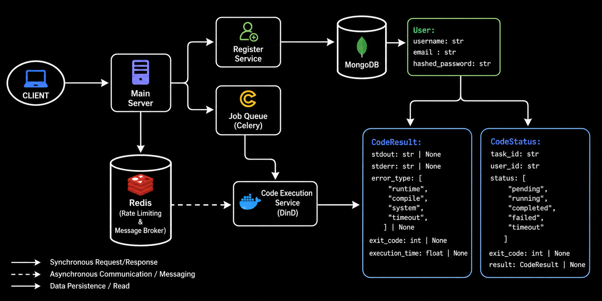

# Own-IDE API

A fast, secure, containerized code execution engine built with **FastAPI**, **Docker**, **Celery**, and **Redis**.

Own-IDE lets users run code in multiple languages (Python, C++, Java, JavaScript) inside isolated Docker containers. Every execution is sandboxed, resource-limited, and tracked - making it safe enough to expose as an API and fast enough for real usage.

Think of it as the backend engine for an online IDE or judge system.

---

## What It Does

* **Run code in multiple languages**
  Supports Python, C++, Java, and JavaScript.

* **Safe sandboxing with Docker**
  Every execution runs in a fresh container with CPU and memory limits.

* **Asynchronous Task Queue (Celery Integration)**
  Code executions are offloaded to **Celery workers** using **Redis** as the message broker. This ensures the FastAPI server remains non-blocking and highly responsive, easily scaling to handle multiple concurrent code executions.

* **Fast rate limiting with Redis**
  Guest users are rate-limited with sub-millisecond checks.

* **Tiered access model**

  * **Guests:** 5 requests per day (tracked using cookies + IP).
  * **Authenticated users:** Unlimited access via JWT.

* **Execution history**
  All submissions and outputs are stored in MongoDB except the ones generated by guest users.

---

## Tech Stack

* **API:** FastAPI
* **Task Queue:** Celery
* **Containers:** Docker Engine API (DinD)
* **Database:** MongoDB
* **Cache / Broker:** Redis

---

## Architecture & Design Choices

Building a secure code execution engine requires navigating several critical trade-offs:

### 1. Celery over Asyncio Background Tasks
* **Choice:** Offloading execution to Celery workers via Redis.
* **Trade-off:** While FastAPI's `BackgroundTasks` are easier to set up, they run in the same event loop. A runaway Docker container or a thread-blocking operation could freeze the entire API. Celery adds infrastructure overhead but provides true isolation, fault tolerance, and allows us to scale compute workers independently of the web server.

### 2. Docker-in-Docker (DinD) vs WebAssembly
* **Choice:** Ephemeral Docker containers with strict limits (`mem_limit="128m"`, `network_disabled=True`, `pids_limit=20`).
* **Trade-off:** Docker provides incredible language flexibility (Python, Java, C++, Node) and access to native system libraries. However, spinning up a fresh container per request introduces ~300ms of latency overhead compared to lighter solutions like WASM or process-level isolation.

### 3. Polling vs WebSockets
* **Choice:** Clients poll the `/status/{task_id}` endpoint to get execution results.
* **Trade-off:** Polling introduces HTTP overhead and slight latency in receiving the final output. However, it keeps the API completely stateless and easy to load balance. Moving to WebSockets would provide instant results but requires implementing a Redis Pub/Sub backplane so the Celery worker can route the completion event back to the specific FastAPI node holding the user's connection.

### 4. Redis Pipelines vs Individual Queries
* **Choice:** Using Redis `pipeline(transaction=True)` for checking and incrementing guest quotas.
* **Trade-off:** A naive approach would `GET` the current count, check it, and then `INCR` it. Under heavy concurrency, this causes a Race Condition where multiple requests read the same value before any of them increment it. Using a Redis pipeline guarantees atomicity - the `GET`, `INCR`, and `EXPIRE` commands are bundled and executed as a single uninterruptible block.

### 5. MongoDB vs SQL for State
* **Choice:** MongoDB to store execution history.
* **Trade-off:** SQL databases strictly enforce schemas. However, code execution payloads vary wildly - some have standard output, some have massive compilation tracebacks, and some encounter system-level Docker timeouts. MongoDB's NoSQL document structure allows us to flexibly store these unpredictable, deeply nested JSON results without complex database migrations or schema alterations.

### 6. Capping Worker Concurrency
* **Choice:** Running Celery with `--concurrency 4`.
* **Trade-off:** By default, Celery spins up a worker thread for every CPU core. Since Docker execution is highly memory/CPU intensive, uncapped concurrency could lead to the server instantly crashing from OOM (Out of Memory) errors during a traffic spike. Hard-capping concurrency limits maximum throughput but guarantees server stability by creating a safe queue backlog instead of a crash.
---

## Lifecycle of a Code Execution (Data Flow)

<!--  -->

1. **The Request (FastAPI):** A JSON payload containing `language`, `code`, and `input_data` hits the `POST /sandbox/` endpoint.
2. **Quota Check (Redis):** The API checks if the user is authenticated via JWT. If they are a guest, a Redis Pipeline atomically checks and increments their daily quota based on a tracking cookie to prevent abuse.
3. **Database Initialization (MongoDB):** A new document is created in MongoDB with a `pending` status. This guarantees that even if the execution queue is backed up, the user still has a permanent record of their submission.
4. **Queueing (Celery + Redis):** The API avoids blocking its event loop by pushing the `task_id` and payload to the Celery Broker (Redis). It immediately returns the `task_id` to the client.
5. **Execution (Worker + DinD):** A background Celery worker picks up the task from Redis. It connects to the Docker Daemon and spins up a highly restricted, ephemeral container (no network access, strict memory limits). The code is injected, compiled (if necessary), and executed.
6. **Result Persistence (Worker -> MongoDB):** Once Docker finishes and returns the raw `stdout`/`stderr` streams, the Celery worker formats the output and updates the original MongoDB document with the final status and logs.
7. **Client Polling (FastAPI):** Throughout this process, the user's browser is polling `GET /status/{task_id}`. Once the MongoDB document is updated by the worker, the API fetches it and returns the final code output to the UI.

---

## Project Structure

```text
├── apis/
│   ├── v1/
│   │   ├── route_login.py    # Handles exposed token for authorization
│   │   ├── route_sandbox.py  # Handles code execution requests
│   │   └── route_user.py     # Handles register
│   ├── __init__.py
│   └── base.py               # Accumulates all the routers in one place
├── core/
│   ├── config.py             # Environment settings
│   ├── hashing.py            # Handles hashing of passwords
│   └── security.py           # Handles creation of access token
├── db/
│   ├── db_session.py         # Async MongoDB setup
│   ├── redis_session.py      # Async Redis setup  
│   ├── sandbox.py            # Docker execution logic + DB helpers
│   └── user.py               # Auth dependencies
├── schemas/
│   ├── code.py               # Pydantic models related to code submission  
│   ├── token.py              # Pydantic models for Auth Tokens
│   └── user.py               # Pydantic models for user
├── worker/
│   ├── celery_app.py         # Celery application configuration
│   └── tasks.py              # Background tasks (Docker execution)
└── main.py                   # App entry point
```

---

## Setup

### Prerequisites

Make sure you have:

* Docker installed and running
* Python 3.10+

---

### Environment Variables

Create a `.env` file in the project root:

```env
DATABASE_URI="mongodb://mongo:27017"
DATABASE_NAME="ideall"
SUBMISSION_TTL_SECONDS=86400

SECRET_KEY="your_custom_secret_key"
ALGORITHM=HS256
ACCESS_TOKEN_EXPIRE_MINUTES=30

REDIS_HOST="redis"
REDIS_PORT=6379
REDIS_USERNAME=
REDIS_PASSWORD=
REDIS_URL="redis://redis:6379/0"

GUEST_QUOTA=5
IP_EXPIRY_SECONDS=86400  # 1 day in seconds

CELERY_BROKER_URL="redis://redis:6379/0"
CELERY_RESULT_BACKEND="redis://redis:6379/0"

DOCKER_HOST="tcp://dind:2375"
```

---

### Run Locally

```bash
docker compose up --build
```

This starts:
- FastAPI API (`web`)
- Celery worker (`worker`)
- Redis (`redis`) for quota cache + Celery broker/backend
- MongoDB (`mongo`) for persistent data
- Docker-in-Docker sandbox (`dind`) for code execution
